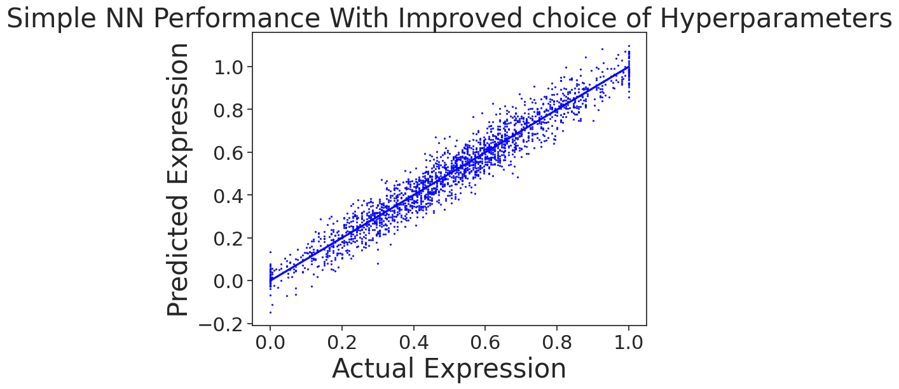
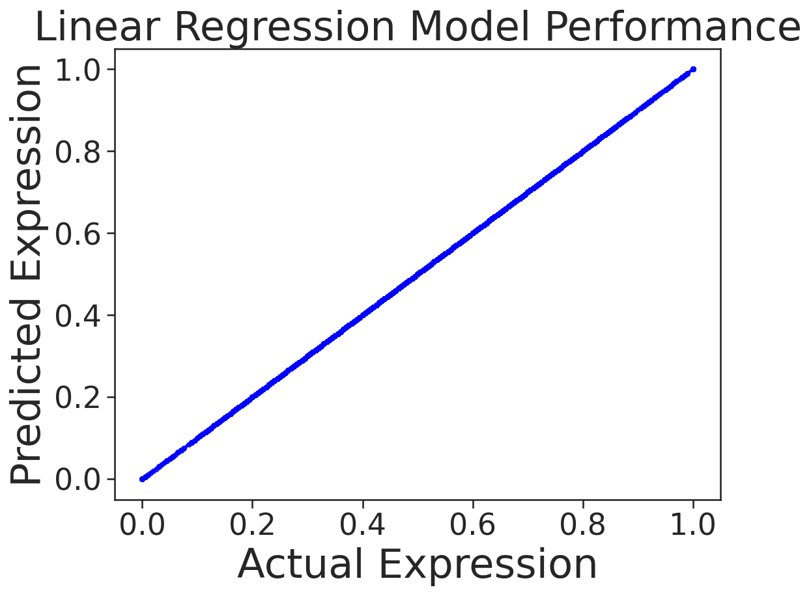

# Genomic Insertion and Sequence Analysis

This repository provides resources and codes I used to conduct a 1.5h ML tutorial for Stem Cell Network Canada. Participants had little/no experience in ML.

Two things covered in the workshop:

1. Utilizing publicly available machine learning models, namely Enformer, Vaishnav et al. 2022, etc. to aid in genome editing.
2. Training a neural network from scratch on sequence-to-expression MPRA (Massively Parallel Reporter Assays) data and highlighting the importance of exploratory data analysis (EDA) in genomics.

## Task 1: Genomic Insertion Optimization

This task involves going through a code that could be used to identify the optimal position in the genome to insert a piece of DNA and selecting the best insulator to ensure the inserted DNA is not influenced by enhancers. For this, we use the Enformer model to predict the impact of the insertion on gene expression. We also show how Vaishnav et al. 2022 transformer model can be used to choose a yeast promoter with desired strength.

## Task 2: Training a Neural Network on MPRA Data

NN             |  Linear Regressor
:-------------------------:|:-------------------------:
  |  

In this task, we train a neural network from scratch on MPRA data. Our aim is to predict gene expression based on the DNA sequence. However, we show that due to GC-content bias in the data, a simple linear regression model can outperform the more complex neural network. This case serves as a reminder of the importance of thorough EDA before training complex models. In genomics, data can contain various sequence-based artifacts that can influence model performance.
